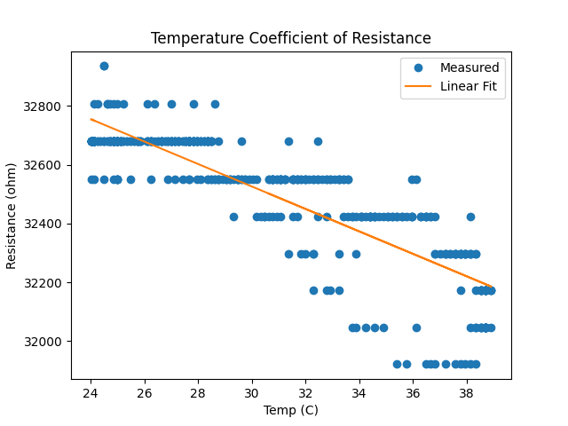
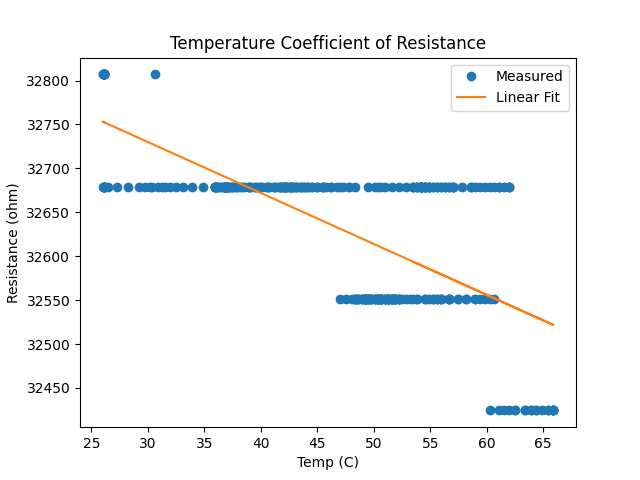

# TCR-Measurement-Tool

## Overview
This project is a Temperature Coefficient of Resistance (TCR) measurement 
tool built around two voltage divider circuits, a NTC thermistor, and an 
Arduino Uno R3. The system simultaneously measures the resistance of a test 
resistor and the surrounding temperature in real time, logging both over 
serial to a Python data pipeline that plots resistance vs temperature and 
extracts TCR via linear regression.

Accurate TCR characterization is directly relevant to semiconductor 
engineering. Process engineers at fabrication facilities routinely measure 
how thin film resistors and other on-chip components behave under thermal 
stress. This project simulates that at a basic level.

## Theory
### Temperature Coefficient of Resistance (TCR)
TCR describes how a resistor's resistance changes per degree of temperature 
change, expressed in ppm/°C:

TCR = (R(T) - R(T₀)) / (R(T₀) · (T - T₀)) × 10⁶

In practice, TCR is extracted by fitting a line to measured R vs T data. 
The slope of that line (dR/dT) divided by the initial resistance R₀ gives 
TCR directly:

TCR = (slope / R₀) × 10⁶

### Resistance from Voltage Divider
The Arduino reads a raw ADC value (0-1023) and converts it to voltage:

V_out = ADC × (5.0 / 1023.0)

The test resistor sits at the bottom of the voltage divider, so resistance 
is back-calculated as:

R_test = (V_out × R_ref) / (5.0 - V_out)

### Temperature from Thermistor; Beta Equation
The thermistor resistance is measured using an identical voltage divider on 
analog pin A1. Temperature is then calculated using the Beta equation:

T = B / (ln(R_therm / R₀) + B / 298.0) - 273.0

Where B = 3950 (Beta constant), R₀ = 10,000Ω (thermistor resistance at 
25°C), and T is in Celsius. Beta constants were sourced from published NTC 
10K thermistor specifications.
## Hardware
 - Arduino Uno R3
 - 2 33kΩ Resistors (voltage divider references for test resistor and thermistor circuits)
 - 1 test Resistor (33kΩ carbon film used in this project, but any resistor can be tested)
 - NTC 10K Thermistor (Should be in contact with Test Resistor)
 - 10K Potentiometer (LCD contrast adjustment)
 - 1k Resistor (LCD backlight current limiter)
 - QAPASS 16x2 LCD Display
 - Breadboard and Jumper wires
 - Heat source (Hair Dryer recommended for 40°C+ temperature range)
   
## Software
### Arduino Sketch
Reads raw ADC values from two analog pins and uses the voltage divider 
equation to back-calculate the resistance of the test resistor and the 
thermistor. Converts thermistor resistance to temperature using the Beta 
equation, outputting both Celsius and Fahrenheit. Displays live temperature 
and resistance readings on the 16x2 LCD and transmits tempC, R_test, and 
R_therm over serial at 9600 baud every 200ms.

### Python Script
Establishes a serial connection with the Arduino and continuously reads 
tempC, R_test, and R_therm into three lists until interrupted with Ctrl+C. 
Upon termination, fits a linear regression to the R_test vs tempC data using 
numpy, extracts TCR from the slope, prints the result, and plots resistance 
vs temperature with the measured data points and fitted line overlaid.

**Libraries used:**
- pyserial --> serial communication with Arduino
- matplotlib --> data plotting
- numpy --> linear regression and array operations
- time --> serial connection delay on startup

**Arduino Libraries:**
- LiquidCrystal.h --> LCD display control

## Results
### Test on 33kΩ Resistor
For my first test I used my fingers to generate the heat. This created a temperature range of ~24°C - 40°C.

For my second test I used a Hair Dryer to generate the heat. This created a temperature range of ~24°C - 67°C.

TCR = -176.9 ppm/C

A negative TCR is characteristic of carbon film resistors, where increased 
thermal energy reduces carrier mobility and therefore resistance. This finding 
is notable because the resistors used were listed as "metal film" in their 
product specifications. Metal film resistors typically exhibit a positive or 
near-zero TCR of ±15 to ±100 ppm/°C. The measured -176.9 ppm/°C suggests 
the product specification is inaccurate, a finding that demonstrates the 
value of real, measured characterization over datasheet trust. 

The resistance data shows discrete horizontal banding rather than a smooth 
continuous curve, which is a direct consequence of the Arduino Uno's 10-bit 
ADC resolution. Each ADC step represents approximately 4.9mV, which at the 
operating resistance range translates to roughly 150Ω per step, larger than 
the per-degree resistance change expected from TCR. Despite this quantization 
limit, the downward trend across bands is consistent and the linear fit 
captures the underlying TCR behavior accurately.
## How to Run
